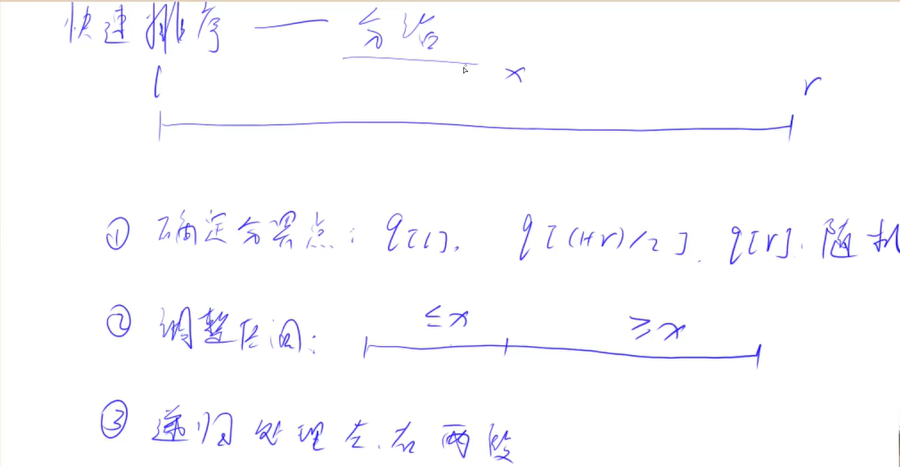

# Read me

算法基础课。代码模板。

# 快排

---
`>=`x的数放左边，`<=`x的数放右边。

- 可以开两个数组，一个a[],一个b[],大于等于x的放a中，小于等于x的放b中。
- 再把a，b中的数放回原数组中。
- 如果忘了如何优美的写的话，可以这样。

---

- 无需开辟空间的优美做法。
    - 双指针， left，right。
    - left遇到>=x的数时停止移动，right遇到<=x的数时停止移动。
    - 交换停止移动的 left，right指向的两个数
    - left，right同时移动一位。